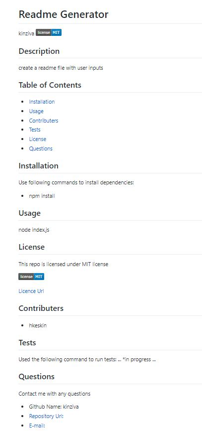

# Professional README Generator

## Description

Every good project deserves a good README with information about the app so the users can install , run and contribute the app. Contributions of others helps to improve a bug free and better application.

This is a command-line application that runs with Node.js then generates a README.md file based on input of the user about the project. Find the READMEsample.md in the repo to see a generated readme file.
readmeSampleScreenshot.JPG
 

## User Story

```md
AS A developer
I WANT a README generator
SO THAT I can quickly create a professional README for a new project
```

## Acceptance Criteria

```md
GIVEN a command-line application that accepts user input
WHEN I am prompted for information about my application repository
THEN a high-quality, professional README.md is generated with the title of my project and sections entitled Description, Table of Contents, Installation, Usage, License, Contributing, Tests, and Questions
WHEN I enter my project title
THEN this is displayed as the title of the README
WHEN I enter a description, installation instructions, usage information, contribution guidelines, and test instructions
THEN this information is added to the sections of the README entitled Description, Installation, Usage, Contributing, and Tests
WHEN I choose a license for my application from a list of options
THEN a badge for that license is added near the top of the README and a notice is added to the section of the README entitled License that explains which license the application is covered under
WHEN I enter my GitHub username
THEN this is added to the section of the README entitled Questions, with a link to my GitHub profile
WHEN I enter my email address
THEN this is added to the section of the README entitled Questions, with instructions on how to reach me with additional questions
WHEN I click on the links in the Table of Contents
THEN I am taken to the corresponding section of the README
```

## Table of Contents

* Title

* Description

* User Story

* Acceptance Critaria

* Table of Contents

* Installation

* Usage

* Contributers

* Questions

* Urls

* Video


## Installation

```md
npm init
npm install inquirer
```

## Usage

```md
node index.js
```


## Contributers

*  [H Keskin](https://github.com/kinziva)


## Questions
Contact with me with any questions :[email](mailto:hk@gmail.com), [GitHub](https://github.com/kinziva)<br />


## Urls
* Application:  [Application URL](https://kinziva.github.io/HKreadMEgenerator/.)
* Repository [Repository URL ](https://github.com/kinziva/HKreadMEgenerator)


## Video

* Your GitHub repository containing your application code.


Because this application won’t be deployed, you’ll also need to provide a link to a walkthrough video that demonstrates its functionality. Revisit the Screencastify Tutorial in the prework as a refresher on how to record video from your computer. You’ll need to submit a link to the video _and_ add it to the README of your project.


### Walkthrough Video: 27%

* A walkthrough video that demonstrates the functionality of the README generator must be submitted, and a link to the video should be included in your README file.

* The walkthrough video must demonstrate how a user would invoke the application from the command line.

* The walkthrough video must demonstrate how a user would enter responses to all of the prompts in the application.

* The walkthrough video must demonstrate a generated README that matches the user input and has a functioning table of contents.

### Technical Acceptance Criteria: 40%

* Satisfies all of the above acceptance criteria plus the following:

	* Uses the [Inquirer package](https://www.npmjs.com/package/inquirer).

### Repository Quality: 13%

* Repository has a unique name.

* Repository follows best practices for file structure and naming conventions.

* Repository follows best practices for class/id naming conventions, indentation, quality comments, etc.

* Repository contains multiple descriptive commit messages.

* Repository contains a high-quality README with description and a link to walkthrough video.


## Review

You are required to submit the following for review:

* A walkthrough video demonstrating the functionality of the application.

* A sample README.md file for a project repository generated using your application

* The URL of the GitHub repository, with a unique name and a README describing the project

